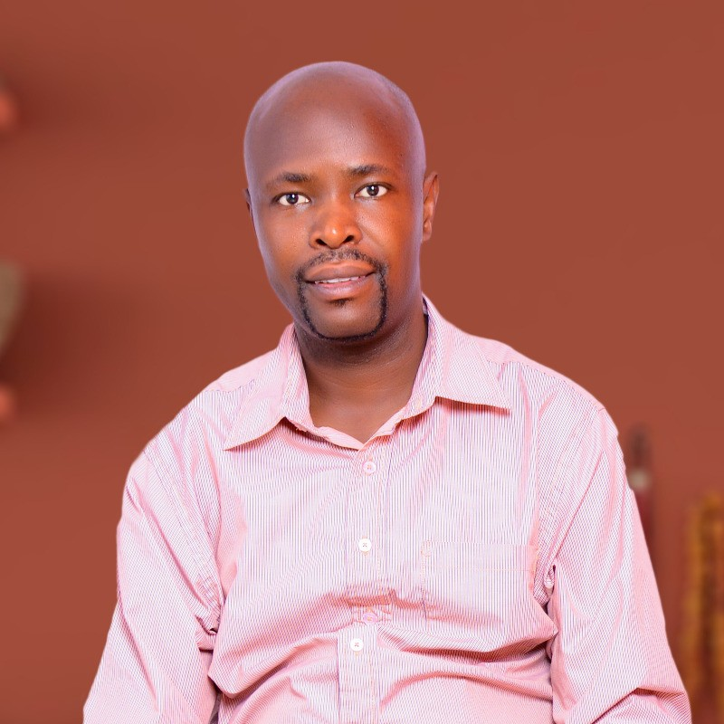

  

## Professional Summary

I am a dedicated and detail-oriented Statistical Programmer/Statistician with 6+ years of proven track record in designing, implementing, and validating statistical models to extract meaningful insights from complex data sets. Hands-on experience in
conducting statistical programming for clinical trial research projects within
Contract Research Organizations (CROs). 

Adept at generating comprehensive summary tables, listings, and figures, 
with expertise in both simple and complex macro development. 
Skilled in data management, including the review and update of 
dataset specifications for efficacy and non-efficacy studies.

Skilled at developing and implementing statistical models to enhance risk
management, predict loan default, and fraud detection strategies in the banking sector.

**Therapeutic Area Experience:** *Oncology*, *Pediatrics*, *Respiratory* and
*Cardiovascular*. A proven team player with excellent interpersonal and
communication skills.

Other platforms that you can find me include LinkedIn and GitHub:

[LinkedIn](https://www.linkedin.com/in/eric-odongo-84177ba2)

[GitHub](https://github.com/rikoprogrammer)

## Educational Background

- Msc in Statistical Science - Strathmore University (2023 - 2026)

- Bsc in Mathematics - Masinde Muliro University (2011 - 2015)

## Work Experience

- Senior Statistical Programmer - IQVIA - Nov 2025 to date
- Senior Data Scientist - Co-op Bank - May - Nov 2025
- Senior Statistical Programmer - Keyrus Life Science - March 2025 - Sep 2025
- Statistical Programmer - MainAnalytics GmbH - May 2024 - March 2025
- Statistical Programmer - Phastar - Feb 2021 - March 2024

## Personal Projects

### Shiny application

I developed this shiny application to meet the requirements of a client on Upwork. They wanted a platform where they could
upload their data and try out a number of statistical and machine learning models.

[Shiny App](https://4lt3sb-eric-odongo.shinyapps.io/shinyApp/)

### Book project

I am currently working on a book that teaches people how to perform statistical
programming in the pharmaceutical industry using R programming language.

[Book](https://statsprogrammingbook.netlify.app/)

### Consulting Firm

I am currently setting up a consulting firm where I will be offering statistical consultancy services in Data Science,
clinical trials, and other data related topics.

[EPM](https://epm-square-analytics.netlify.app/)
